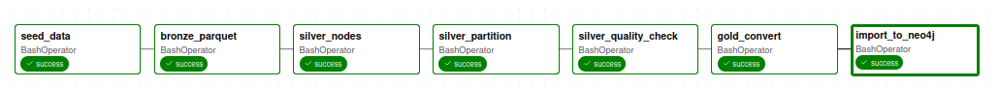
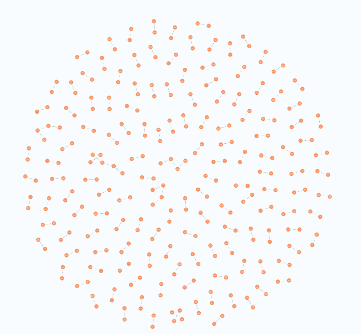
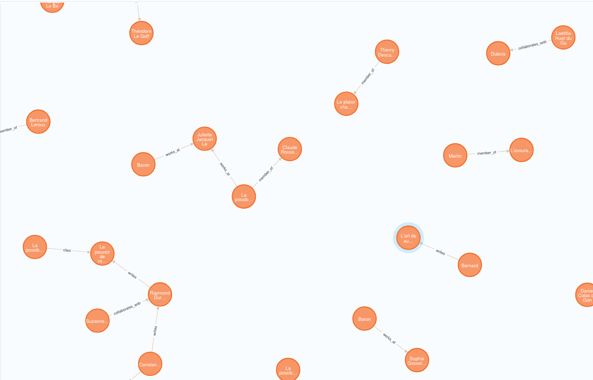

# Architecture Médaillon x Graphes de Connaissances

## Description

Ce projet met en œuvre une pipeline de données complète basée sur l’**architecture Médaillon** (Bronze - Silver - Gold) afin de construire et exposer un **graphe de connaissances** à grande échelle.

Le but est de créer une chaîne de traitement modulaire et traçable pour la donnée, en intégrant des outils modernes d’orchestration, de stockage, de monitoring et d’exposition.

## Objectifs principaux

* Ingestion et transformation d’un grand volume de données de graphe (entités, relations)
* Structuration du traitement en couches claires :

  **Bronze** (brut) à  **Silver** (nettoyé et partitionné) vers **Gold** (analytique et exploitable)
* Automatisation du pipeline avec **Apache Airflow**
* Validation de la qualité et de la cohérence des données avec **Great expectations**
* Exposition via **API FastAPI** connectée à **Neo4j**
* Préparation à la supervision via  **Prometheus** , **Grafana** et **Marquez**

## Architecture du projet


```
projet/
├── docker-compose.yaml
├── .env
├── Makefile
├── api/
│   ├── Dockerfile
│   ├── requirements.txt
│   └── main.py
├── dags/
│   └── ingest_kg.py
├── data/
│   ├── raw/
│   ├── bronze/
│   ├── silver/
│   └── gold/
├── scripts/
│   ├── convert_toneo4j_csv.py
│   ├── generate_sample_data.py
│   ├── import_goldtoneo4j_cypher_*.py
│   ├── nodes_to_silver.py
│   ├── partition_edges.py
│   └── to_parquet.py
├── quality/
│   └── gx_checkpoint.py
├── lineage/
│   └── openlineage.yml
├── grafana/
│   ├── prometheus.yml
│   └── dashboards/
└── images/
    ├── neo4j_graph_exemple.png
    ├── neo4j_graph_limit.png
    └── pipeline_airflow.png

```


## Stack Technique

| Outil                    | Rôle principal                              | Port(s)                |
| ------------------------ | -------------------------------------------- | ---------------------- |
| **Neo4j**          | Base de données graphe, stockage Gold       | 7474 (UI), 7687 (Bolt) |
| **Apache Airflow** | Orchestration des tâches du pipeline        | 8080                   |
| **FastAPI**        | API REST pour exposer les données du graphe | 8000                   |
| **Marquez**        | Suivi de la lignée de données (lineage)    | 5000                   |
| **Prometheus**     | Collecte et agrégation de métriques        | 9090                   |
| **Grafana**        | Visualisation et tableaux de bord            | 3000                   |

## Détail des couches

### Couche Bronze

* Contient les **données brutes** importées depuis des CSV du fichier raw/
* Objectif : conserver la source originale, sans transformation
* Format : **Parquet** pour une meilleure compression et compatibilité analytique

### Couche Silver

* Données  **nettoyées, validées et partitionnées**
* Vérifications automatiques via **Great Expectations** (unicité, nulls, cohérence)
* Partitionnement des relations (edges) en plusieurs shards pour la performance

### Couche Gold

* Données **prêtes pour la consommation** et  **intégrées dans Neo4j**
* Transformation des colonnes au format attendu par Neo4j (id:ID,:START_ID ...)
* Cette couche est utilisée pour la **visualisation** et l’interrogation via l’API

## Orchestration avec Airflow

L’orchestration repose sur un **DAG** défini dans dags/ingest_kg.py 

Les tâches principales sont :

1. **Seed** : génération de données synthétiques (entités et relations)
2. **Bronze** : conversion CSV à Parquet
3. **Silver** : nettoyage et partitionnement
4. **Gold** : export vers Neo4j

Airflow permet d’exécuter et de surveiller chaque étape du pipeline depuis son interface web

**Pipeline final Airflow :**



## Base de données Neo4j

Les données finales (couche Gold) sont importées dans  **Neo4j** , où elles sont représentées sous forme de graphe :

* **Nodes** : entités (Person, Org, Paper)
* **Edges** : relations entre ces entités

Cette structure permet d’effectuer des requêtes **Cypher** et de visualiser le graphe de connaissances.

**Graphe Neo4j :**






## API FastAPI

L’API permet de dialoguer avec la base Neo4j

À ce stade, seule une route de test est opérationnelle :

* GET/health: vérifie l’état de l’API

Routes prévues pour la suite :

* POST /query/cypher : exécution d’une requête Cypher
* GET /entity/{id} :récupération d’un nœud et de ses voisins

## À venir

### Observabilité

* Intégration complète de **Prometheus** pour la collecte de métriques
* Création de tableaux de bord **Grafana** pour visualiser la performance et l’état du pipeline
* Ajout de **Marquez** pour la traçabilité et le suivi de la lignée des données (OpenLineage)

### API

* Implémentation des endpoints POST /query/cypher et GET /entity{id}
* Gestion des erreurs et des statuts HTTP
* Documentation interactive via Swagger

### Tests et validation

* Ajout de tests unitaires sur les scripts et DAGs
* Extension des contrôles de qualité dans Great Expectations
